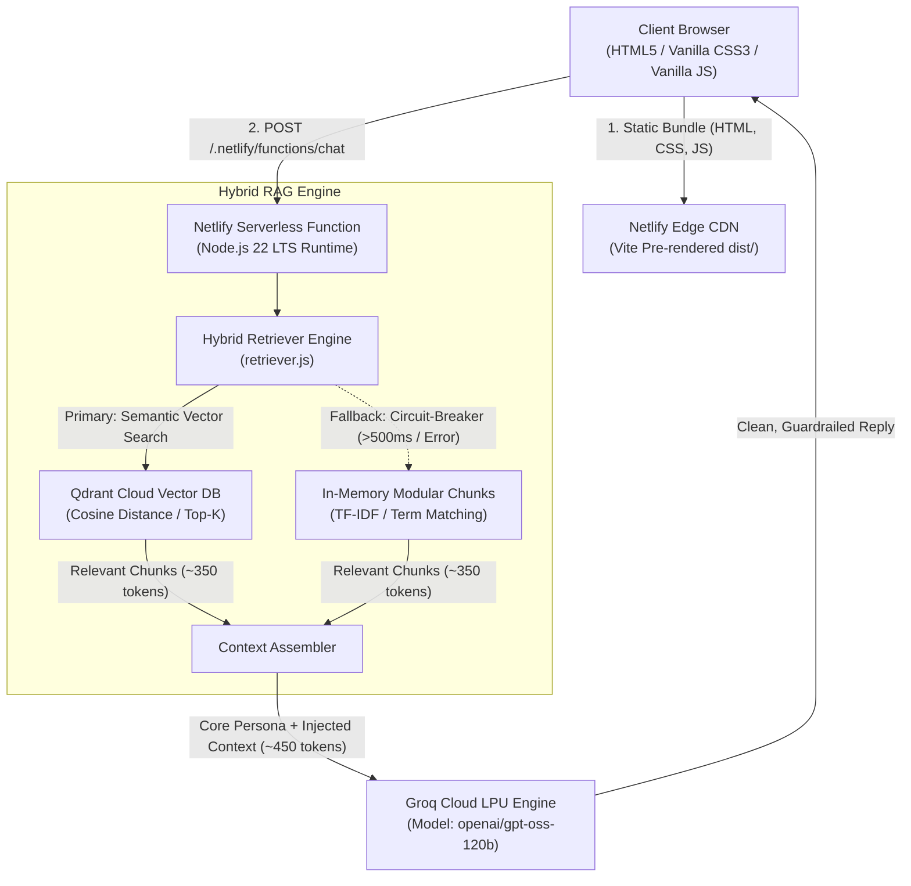
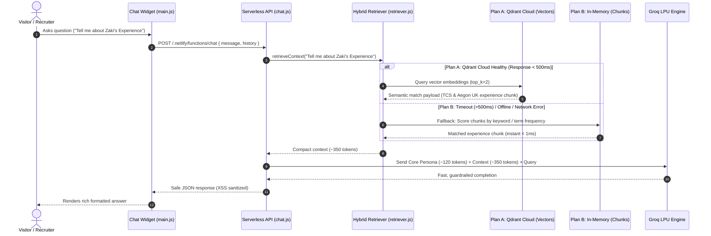

# Md Zaki Hussain — AWS Data Engineer & Cloud Architect Portfolio

[](https://mdzakihussain.netlify.app/)


A high-performance, responsive engineering portfolio and AI-powered interactive assistant.

---

## 📌 Table of Contents
1. [Overview & Engineering Persona](#-overview--engineering-persona)
2. [End-to-End System Architecture](#-end-to-end-system-architecture)
3. [Technology Stack](#-technology-stack)
4. [AI Assistant: X-Bot & Hybrid RAG Architecture](#-ai-assistant-x-bot--hybrid-rag-architecture)
   - [4.1 The Root Cause: 8K TPM Rate Limit Bottleneck](#41-the-root-cause-8k-tpm-rate-limit-bottleneck)
   - [4.2 The Dual-Engine Strategy: Best of Both Worlds](#42-the-dual-engine-strategy-best-of-both-worlds)
   - [4.3 Plan A: Qdrant Cloud Vector Database Pipeline](#43-plan-a-qdrant-cloud-vector-database-pipeline)
   - [4.4 Plan B: In-Memory Sub-Millisecond Fallback Engine](#44-plan-b-in-memory-sub-millisecond-fallback-engine)
   - [4.5 The Hybrid Retriever & Circuit Breaker Logic](#45-the-hybrid-retriever--circuit-breaker-logic)
   - [4.6 Token Optimization & Capacity Benchmarks](#46-token-optimization--capacity-benchmarks)
5. [Lead Capture & Netlify Forms](#-lead-capture--netlify-forms)
6. [Technical SEO & Search Discoverability](#-technical-seo--search-discoverability)
7. [Security Hardening & Guardrails](#-security-hardening--guardrails)
8. [Local Development & Deployment](#-local-development--deployment)

---

## 👤 Overview & Engineering Persona

- **Name:** Md Zaki Hussain
- **Role:** AWS Data Engineer
- **Organization:** Tata Consultancy Services (TCS)
- **Client & Project:** Aegon UK (Enterprise Cloud Data Platform)
- **Core Stack:** Python, SQL, PySpark, AWS, PostgreSQL, Terraform etc

---

## 🏗 End-to-End System Architecture



---

## 🛠 Technology Stack

### Frontend & UI/UX
- **Markup & Styling:** Semantic HTML5, Vanilla CSS3 (Custom Design Tokens, HSL Color Palettes, Glassmorphism, CSS Grid & Flexbox).
- **Icons & Typography:** RemixIcon CDN (with Subresource Integrity), Google Fonts (*Plus Jakarta Sans* & *JetBrains Mono*).
- **Bundler & Build Tool:** Vite 5.4.x (Sub-50ms HMR and tree-shaken static production bundles).
- **Accessibility & UX:** Screen-reader friendly semantic landmarks, floating scroll indicator with smooth window-fade behavior, zero-lag copy-to-clipboard feedback.

### Backend & Serverless
- **Runtime:** Node.js 22 LTS on Netlify Functions v2 (Web Standard `Request`/`Response` APIs).
- **Local Dev Server:** Custom lightweight Node.js HTTP dev server (`dev_server.js`) mimicking Netlify's serverless environment with live `.env` loading.
- **Form Processing:** Netlify Native Forms with serverless spam filtering and instant email dispatch.

### Cloud & AI
- **LLM Inference Engine:** Groq Cloud LPU (`openai/gpt-oss-120b`) for near-instant response generation (< 500ms latency).
- **Vector Database (Semantic Search):** Qdrant Cloud (Managed cluster with Cosine Distance indexing).
- **In-Memory Fallback Engine:** Pure JavaScript term frequency scoring (< 1ms latency, 0 external dependencies).

---

## 🤖 AI Assistant: X-Bot & Hybrid RAG Architecture (Currently using System Prompt one, This architecture is in development)

### 4.1 The Root Cause: 8K TPM Rate Limit Bottleneck
Early implementations bundled all information, qualifications and experiences into a **single monolithic prompt** (`system_prompt.js`) of ~15,500 characters (**~3,800 tokens**).

On Groq's free tier, all models enforce an **8,000 Tokens Per Minute (TPM)** ceiling:
- **Turn 1:** 3,800 (System Prompt) + 50 (User Query) + 250 (Bot Reply) = **~4,100 tokens**.
- **Turn 2:** 3,800 (System Prompt) + 400 (History) + 50 (User Query) = **~4,250 tokens**.
- **Cumulative 60s Total:** **8,350 tokens > 8,000 TPM limit 💥 (HTTP 429 Error)**.

This made multi-turn conversations stall after just two questions.

---

### 4.2 The Dual-Engine Strategy: Best of Both Worlds
To solve the rate limit while demonstrating enterprise data engineering standards, we architected a **Dual-Engine Hybrid RAG System**:



---

### 4.3 Plan A: Qdrant Cloud Vector Database Pipeline
*Primary path for true semantic similarity, fuzzy matching, and long-term career scaling.*

1. **Vector Index Configuration:**
   - **Collection Name:** `zaki_portfolio_knowledge`
   - **Vector Dimension:** 384 (e.g. `all-MiniLM-L6-v2`) or 768 / 1536 depending on the chosen embedding model.
   - **Distance Metric:** Cosine Similarity (`Cosine`).
2. **Offline Ingestion Pipeline (`scripts/ingest_qdrant.js`):**
   - Reads modular source chunks from `netlify/functions/knowledge/`.
   - Embeds each document into high-dimensional vectors.
   - Upserts points into Qdrant Cloud with metadata payload:
     ```json
     {
       "id": "chunk_experience",
       "vector": [0.021, -0.043, 0.128, "..."],
       "payload": {
         "topic": "experience",
         "title": "TCS Aegon UK Data Platform",
         "content": "AWS Data Engineer at TCS managing 1B+ records, Apache Hudi OCC, PySpark ETL...",
         "tags": ["aws", "glue", "hudi", "pyspark", "postgres", "tcs", "aegon"]
       }
     }
     ```
3. **Online Semantic Querying:**
   - User query is vectorized via the embedding service.
   - Searches Qdrant Cloud with `score_threshold: 0.65` and `limit: 2`.
   - Returns the exact relevant paragraphs to inject into the LLM context.

---

### 4.4 Plan B: In-Memory Sub-Millisecond Fallback Engine
*Deterministic, zero-dependency safety net guaranteeing 100% portfolio uptime.*

1. **Modular Source-of-Truth Chunks (`netlify/functions/knowledge/`):**
   - `core_persona.js` (~120 tokens): Identity.
   - `chunk_experience.js` (~350 tokens): All experiences.
   - `chunk_projects.js` (~350 tokens): Different Enterprise Projects.
   - `chunk_skills.js` (~200 tokens): Skillset.
   - `chunk_education.js` (~150 tokens): Qualifications.
   - `chunk_contact.js` (~100 tokens): Social Links.
2. **Term Frequency Scorer:**
   - Tokenizes and normalizes the user query.
   - Calculates weighted term-overlap and intent scores across chunk tag indices.
   - Selects the top 1 or 2 chunks in **< 1 millisecond** with zero external network dependencies.

---

### 4.5 The Hybrid Retriever & Circuit Breaker Logic
The serverless function invokes `retrieveContext(userQuery)` via `retriever.js`:
- **Timeout Circuit-Breaker:** An `AbortController` enforces a strict **500ms timeout** on Qdrant Cloud calls.
- **Failover Conditions:**
  - If Qdrant Cloud free-tier cluster is sleeping or encounters cold starts (> 500ms),
  - If network or API limits occur,
- **Execution:** Instantly routes to **Plan B (In-Memory)** without throwing errors to the user.

---

### 4.6 Token Optimization & Capacity Benchmarks

| Metric | Monolithic Setup | Hybrid RAG Setup | Engineering Gain |
| :--- | :--- | :--- | :--- |
| **System Prompt Tokens** | ~3,800 tokens | **~450 tokens** | **88% reduction** |
| **Total Turn Cost** | ~4,200 tokens | **~700 tokens** | **83% cost savings** |
| **Turns within 8K TPM Limit** | 1 – 2 turns ❌ | **11 – 12 turns ✅** | **6x query capacity** |
| **Retrieval Failover Latency**| N/A | **< 1 millisecond** | Zero downtime |

---

## 📬 Lead Capture & Netlify Forms

The contact form is wired directly into Netlify's build-time form parsing:
- **Zero Third-Party Dependency:** Submissions submit asynchronously via `fetch('/', { method: 'POST', body: ... })` with in-place toast notifications.
- **Honeypot Anti-Spam Protection:** Includes a hidden `bot-field` input (`tabindex="-1"`, `aria-hidden="true"`). Automated spam bots that fill this field are dropped silently by Netlify without consuming free monthly submission quotas.
- **Instant Alerts:** Connected to Netlify notification hooks for instant email forwarding to `mdzakihusain@gmail.com`.

---

## 🔍 Technical SEO & Search Discoverability

- **Canonical Authority:** `<link rel="canonical" href="https://mdzakihussain.netlify.app/" />` ensures single source of truth across search engines.
- **Structured Data (Schema.org JSON-LD):** Implements dual `@graph` schema (`Person` and `WebSite`) identifying Md Zaki Hussain, job title, employer (TCS), verified social profiles, and core competency topics for the Google Knowledge Graph.
- **Crawl Directives:**
  - `public/sitemap.xml`: Complete XML sitemap declaration.
  - `public/robots.txt`: Directs Googlebot and Bingbot to the sitemap.
- **Search Engine Integrations:**
  - **Google Search Console:** Verified property with active indexing pipeline.
  - **Bing Webmaster Tools:** Synced to power Microsoft Copilot, ChatGPT web search, and DuckDuckGo.
  - **Social Sharing:** Optimized OpenGraph & Twitter cards with compliant descriptions (> 100 characters) verified via LinkedIn Post Inspector.

---

## 🔒 Security Hardening & Guardrails

- **OWASP LLM05 Mitigation (Prompt Injection to XSS):** Model replies undergo `escapeHTML()` sanitization before markdown parsing, neutralizing malicious payloads such as `` and strictly verifying link schemes (`/^https?:\/\//i`) to block `javascript:` URI execution.
- **Serverless API Guardrails:** `netlify/functions/chat.js` enforces strict cross-origin verification (`ALLOWED_ORIGINS`), rejecting unauthorized third-party callers (`403 Forbidden`) and blocking payloads exceeding 10 KB (`413 Payload Too Large`).
- **HTTP Security Headers (`netlify.toml`):**
  - `Content-Security-Policy (CSP)`: Strict source lockdown (`script-src 'self'`, `frame-ancestors 'none'`, `form-action 'self'`).
  - `Strict-Transport-Security (HSTS)`: 2-year duration with subdomains and preload eligibility.
  - `X-Frame-Options`: `DENY` against clickjacking.
  - `X-Content-Type-Options`: `nosniff`.
- **Zero Secret Exposure:** Zero hardcoded API keys; verified clean git history with environment variable injection at runtime.

---

## 💻 Local Development & Deployment

### Prerequisites
- Node.js >= 22.0.0
- npm >= 10.0.0

### Setup
```bash
# Clone the repository
git clone https://github.com/professorx2001/Portfolio.git
cd Portfolio

# Install dependencies
npm install

# Configure environment variables
cp .env.example .env  # Add your GROQ_API_KEY
```

### Running Locally
```bash
# Start frontend dev server (Vite on http://localhost:5173)
npm run dev

# Start local Node.js serverless backend (on http://localhost:5001)
npm run backend

# Build production bundle
npm run build

# Preview production build locally
npm run preview
```

### Deployment
Pushes to the `main` branch automatically trigger a Netlify Edge build:
1. `npm run build` runs `vite build`.
2. Output artifacts in `dist/` are published to edge nodes worldwide.
3. Serverless functions in `netlify/functions/` are compiled to the Node.js 22 AWS Lambda runtime.

---

## 📜 License
Copyright © 2026 Md Zaki Hussain. All rights reserved.
